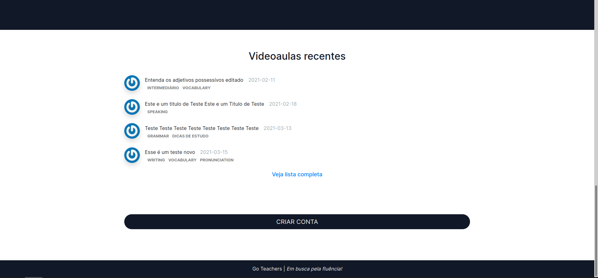
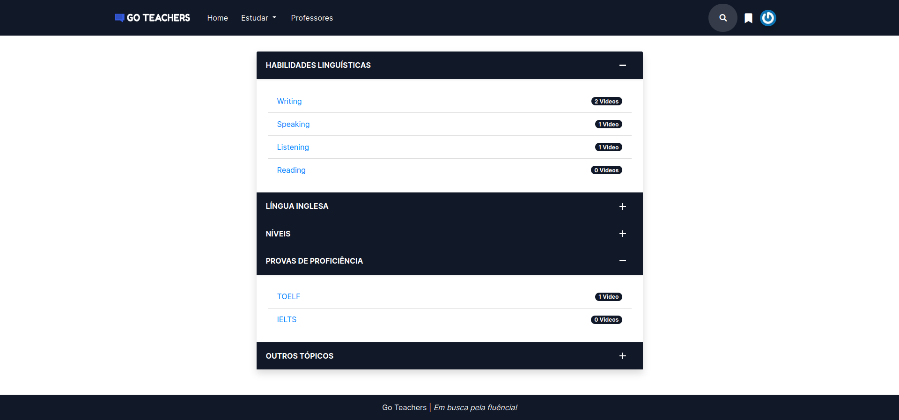
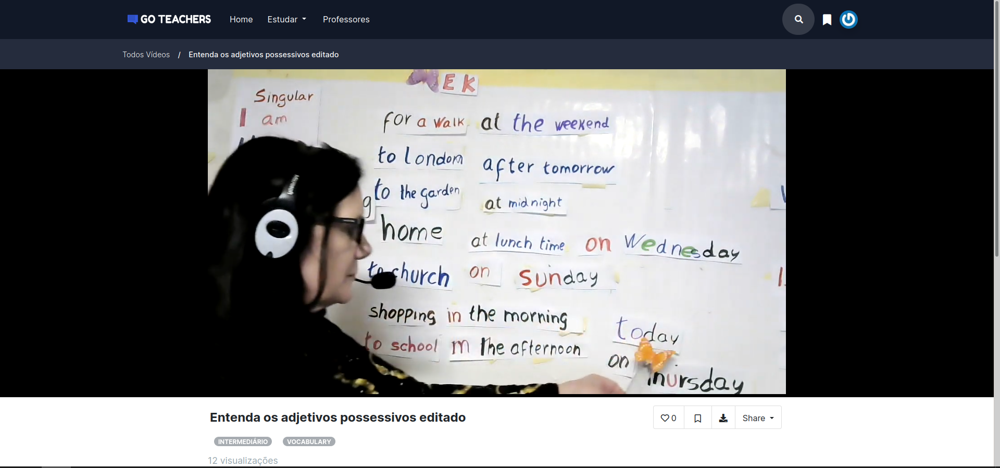
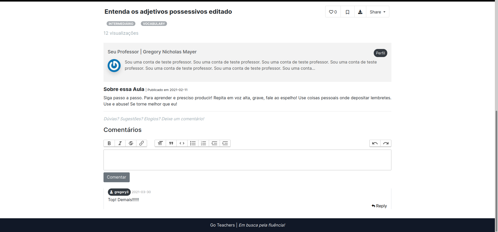
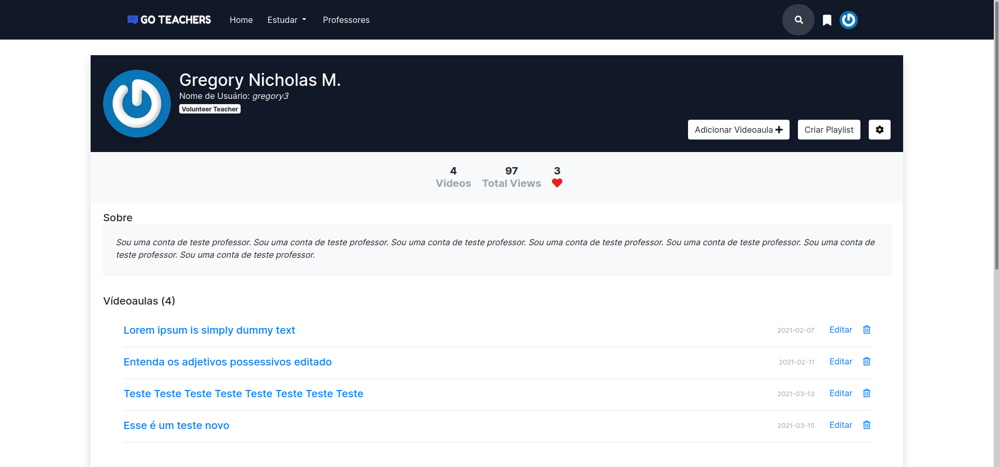
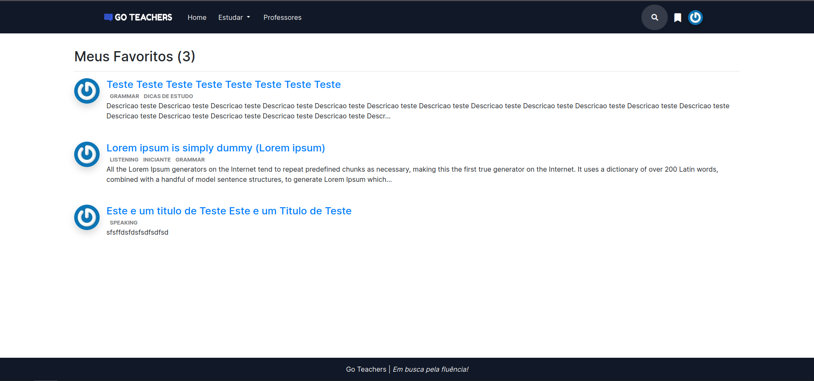

## Projeto de TCC
Aplicação web de videoaulas para ensino da língua inglesa. 
<b>Este projeto está sendo refeito.</b>

### Stack
`Ruby 2.7` 
`Rails 5.1` 
`Bootstrap 4` 
`SQLite` 

### Documento
Meu TCC está disponível <a href='https://repositorio.ufsc.br/handle/123456789/228483'>aqui</a>.

### Screenshots

#### Homepage

 

#### Categorias

#### Videoaula

#### Perfil

#### Favoritos

